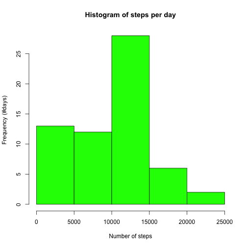
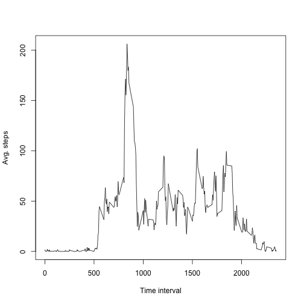
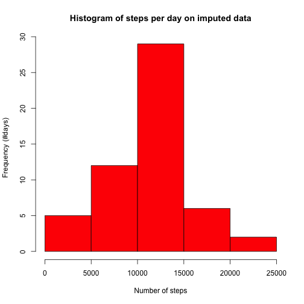
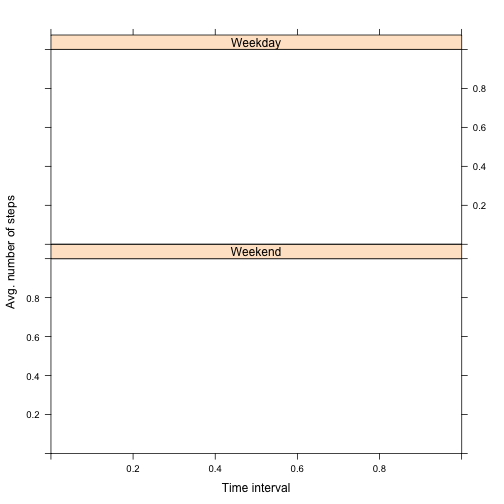

```r
# TODO: remove
setwd("/Users/albanag/coursera/datasciencecoursera/repdata/RepData_PeerAssessment1")
library(dplyr)
```

## Loading and preprocessing the data


```r
# load the data
df<-read.csv("activity.csv", sep=",",header=TRUE)
# transform the date variable into a Date type
df$date = as.Date(df$date, format="%Y-%m-%d")
```

## What is mean total number of steps taken per day?

*1. Calculate the total number of steps taken per day.*


```r
# We first create a data frame that groups the rows by date.
df1 <- df %>%
    group_by(date)  %>%
    summarise(            
      sum_steps = sum(steps, na.rm=TRUE)           
    )
```

*2. Make a histogram of the total number of steps taken each day.*

```r
hist(df1$sum_steps, xlab="Number of steps", ylab="Frequency (#days)", main="Histogram of steps per day", col="green") 
```

 

*3. Calculate and report the mean and median of the total number of steps taken per day.*


```r
avg_steps_per_day = mean(df1$sum_steps, rm.na=TRUE)
median_steps = median(df1$sum_steps)
cat("Average number of steps per day is ", avg_steps_per_day) 
```

```
## Average number of steps per day is  9354.23
```

```r
cat("Median of total number of steps per day is ", median_steps)
```

```
## Median of total number of steps per day is  10395
```

## What is the average daily activity pattern?  

*1. Make a time series plot (i.e. type = "l") of the 5-minute interval (x-axis) and the average number of steps taken, averaged across all days (y-axis) *


```r
df2 <- df %>%
       group_by(interval) %>%
       summarize(
         avg_steps_interval = mean(steps, na.rm=TRUE)  
         )
plot(df2$interval, df2$avg_steps_interval, xlab="Time interval", ylab="Avg. steps", type="l")
```

 

*2. Which 5-minute interval, on average across all the days in the dataset, contains the maximum number of steps?*


```r
max_num_steps = max(df2$avg_steps_interval)
interval_max_steps = subset(df2, df2$avg_steps_interval==max_num_steps)$interval
interval_max_steps
```

```
## [1] 835
```

## Imputing missing values

*1.Calculate and report the total number of missing values in the dataset (i.e. the total number of rows with NAs)*

```r
num_rows_with_na = nrow(df[is.na(df), ])
num_rows_with_na
```

```
## [1] 2304
```

*2.Devise a strategy for filling in all of the missing values in the dataset*

```r
# The strategy to impute missing data consists of filling out the NAs of a given interval with the mean value of that interval.
```

*3.Create a new dataset that is equal to the original dataset but with the missing data filled in.*

```r
# this function returns the mean number of step in a given interval
get_mean_steps_int <- function(x) {  
  return(df2[df2$interval == x, ]$avg_steps_interval)
}
# create a copy of the original data frame
df_impute <- df

# replace the missing values of the interval with their corresponding mean value
df_impute$steps <- ifelse(is.na(df_impute$steps), get_mean_steps_int(df_impute$interval), df_impute$steps )
head(df)
```

```
##   steps       date interval
## 1    NA 2012-10-01        0
## 2    NA 2012-10-01        5
## 3    NA 2012-10-01       10
## 4    NA 2012-10-01       15
## 5    NA 2012-10-01       20
## 6    NA 2012-10-01       25
```

```r
head(df_impute)
```

```
##       steps       date interval
## 1 1.7169811 2012-10-01        0
## 2 0.3396226 2012-10-01        5
## 3 0.1320755 2012-10-01       10
## 4 0.1509434 2012-10-01       15
## 5 0.0754717 2012-10-01       20
## 6 2.0943396 2012-10-01       25
```

```r
num_rows_with_na = nrow(df_impute[is.na(df_impute), ])
num_rows_with_na
```

```
## [1] 2016
```

*4.Make a histogram of the total number of steps taken each day and Calculate and report the mean and median total number of steps taken per day. Do these values differ from the estimates from the first part of the assignment? What is the impact of imputing missing data on the estimates of the total daily number of steps?*


```r
# Number of steps taken each day: same as before, we group rows by date.
df_impute1 <- df_impute %>%
              group_by(date) %>%
              summarize(                  
                  sum_steps = sum(steps)            
                )
# Histogram of imputed data
hist(df_impute1$sum_steps, xlab="Number of steps", ylab="Frequency (#days)", main="Histogram of steps per day on imputed data", col="red")
```

 

```r
# Histogram of original data
hist(df1$sum_steps, xlab="Number of steps", ylab="Frequency (#days)", main="Histogram of steps per day", col="green") 
```

 

```r
avg_steps_per_day_impute = mean(df_impute1$sum_steps)
median_steps_impute = median(df_impute1$sum_steps)
impute_data = c(avg_steps_per_day_impute, median_steps_impute)
actual_data = c(avg_steps_per_day, median_steps)
tab = data.frame(impute_data, actual_data)
row.names(tab) <- c("avg_steps", "median_steps")
tab
```

```
##              impute_data actual_data
## avg_steps             NA     9354.23
## median_steps          NA    10395.00
```

```r
# There is a difference between the average values of the original and imputed data. 
# The difference is that more intervals in the imputed dataset have the average value. That brings the overall average value slightly higher than the original data. 
```

## Are there differences in activity patterns between weekdays and weekends?

*1. Create a new factor variable in the dataset with two levels – “weekday” and “weekend” indicating whether a given date is a weekday or weekend day.*

```r
# Add new column with daytype
df_impute$day_type <- ifelse(weekdays(df_impute$date) %in% c("Monday", "Tuesday", "Wednesday", "Thursday", "Friday"),factor("WEEKDAY", levels=c("WEEKEND","WEEKDAY")), factor("WEEKEND", levels=c("WEEKEND","WEEKDAY")))

df_panel <- df_impute %>%
            group_by(interval,day_type) %>%
            summarise(
              avg_steps_interval = mean(steps)
            )
```

*2. Make a panel plot containing a time series plot (i.e. type = "l") of the 5-minute interval (x-axis) and the average number of steps taken, averaged across all weekday days or weekend days (y-axis).*

```r
library(lattice)
xyplot(avg_steps_interval~interval | factor(day_type, labels=c("Weekend", "Weekday")), data=df_panel, type="l",
       main="", xlab="Time interval",  ylab="Avg. number of steps",layout=c(1,2))
```

 

```r
# There is a clear difference between the weekend and the weekdays. In weekends the number of steps is more evenly distributed throughout the whole day, while during the weekdays the number of steps follow a different pattern.
```
